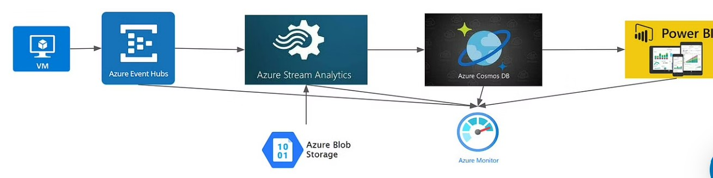

# Azure Stream Analytics for Real-Time Cab Service Monitoring

## Problem Statement
In this project, we will address the problem of Real-Time cab service monitoring. 
Usage of cab services like Uber, Ola, etc., are increasing day by day, and they have become a part of the regular commute.
The architecture diagram given is a replica of how these companies monitor their real-time booking service via the Power BI dashboard.

## Tech Stack
Services: Azure VM, Docker, Azure Stream Analytics, Azure Event Hubs, Blob Storage, Cosmos DB, Power B

## Architecture

### Azure VM

Azure Virtual Machines (VM) are one of several forms of scalable, on-demand computing resources offered by Azure. VMs are typically used when you want greater control over the computing environment than the other options provide. An Azure VM provides you virtualization flexibility without the need to purchase and maintain the actual hardware that runs it. You must still maintain the VM by configuring, patching, and installing the software that runs on it.

### Azure Stream Analytics

Azure Stream Analytics is a real-time analytics and sophisticated event processing engine for analyzing and processing large amounts of rapid streaming data from various sources at the same time. Information gathered from a variety of input sources, including devices, sensors, clickstreams, social media feeds, and apps, may be used to identify patterns and correlations. These patterns may be used to start workflows and trigger activities like issuing alarms, sending data into a reporting platform, or storing altered data for later use.

### Azure Event Hubs

Azure Event Hubs is a large data streaming platform and event ingestion service. It can receive and process millions of events per second. Data delivered to an event hub may be converted and saved using any real-time analytics provider or batching/storage adapters.

### Power BI

Power BI is a set of software services, applications, and connections that work together to transform disparate data sources into coherent, visually engaging, and interactive insights. Your data might be in the form of an Excel spreadsheet or a combination of hybrid cloud-based and on-premises data warehouses. Power BI makes it simple to connect to your data sources, visualize and find what's essential, and share it with anyone or whomever you want.

## Approach

We use Event hubs as the ingestion point for cab booking/drop ride details. We simulate real-time data using Azure VM running a generator code.

We use stream analytics to join some reference data like customer details and cab owner details which are maintained in Blob storage. The joined data is used to derive multiple trends like average commission per km, routes with max bookings(to identify trends)

We will keep a copy of the data in cosmos No-SQL DB, which will feed the power BI dashboards for business users' understanding.

Since we are using real-time streaming and analytics service, we might have to monitor it and trigger it in case of input overload via email service to service admin