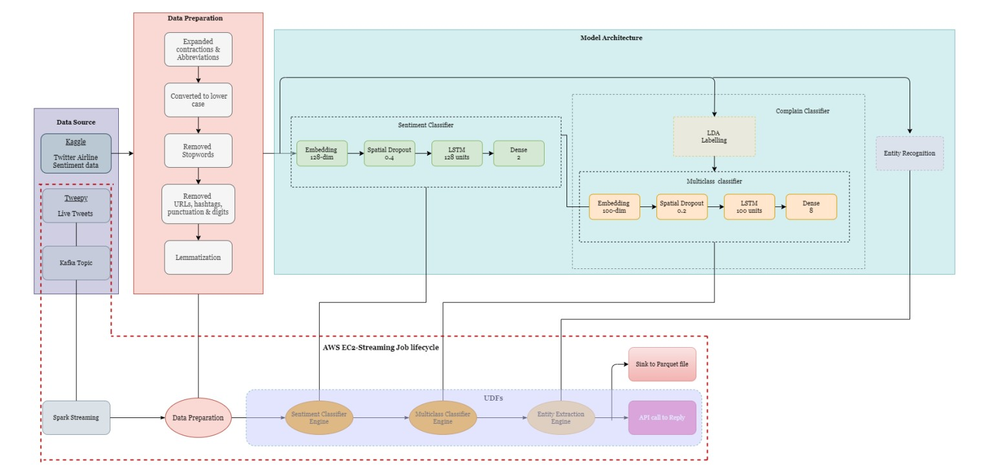

# Deploying auto-reply Twitter handle with Kafka, Spark and LSTM

## Business Overview
Sentiment analysis extracts attitudes and emotions in 
reaction to products, promotions, and events by analyzing the language used in social 
media postings, comments, and reviews. Companies may utilize this data for various 
purposes, including product design, customer service, and advertising campaigns. 
These tools can be clubbed with NER (named entity recognition), a technique for 
recognizing words or sentences as valuable entities. The whole process can be 
automated and deployed on the cloud using data ingestion and streaming services with 
distributed processing.

## Objective
The objective of this Twitter Support project is to listen to live tweets with required tags 
and publish them to a Kafka topic which will be consumed using Spark Stream and 
passed through an NLP pipeline for further processing and replying. The tweets will 
then be classified based on sentiment and query category using machine learning 
models like LSTM before responding to them with a custom ticked ID using Flask and 
tweepy API.

## Architecture

## Data Description
For the training purposes in this project, we have used an “airline tweets” dataset, which 
includes necessary fields like airline names as tags, actual text, sentiment class, i.e., 
positive, negative, or neutral and a topic class which can be one of these:
1. Baggage Issue
2. Customer Experience
3. Delay and Customer Service
4. Extra Charges
5. Online Booking
6. Reschedule and Refund
7. Reservation Issue
8. Seating Preferences

## Tech Stack
➔ Language: Python3
➔ Services: Confluent Kafka, Spark
➔ Libraries: tweepy, Flask, kafka, spacy, sklearn, keras, numpy, pyspark, nltk, 
matplotlib, os
● Tweepy for fetching tweets and replying.
● Flask for setting up API for a reply.
● Kafka for data ingestion.
● Sklearn for model evaluation and encoding.
● Nltk for preprocessing.
● Spacy for named entity recognition.
● Pandas for data manipulation and analysis.
● Matplotlib for plotting graphs.
● Numpy for array and math operations.
● Tensorflow and Keras for loading and building models and Embeddings.
● Pyspark for UDFs and Streaming.
● Os for operating folders.

## Approach
• Dataset is first processed by removing Stopwords, mentions, URLs, etc., and 
Lemmatization.
• Tokenizing and Embedding words to text sequences.
• A sequential model is trained on the processed data, which includes LSTM for 
Sentiment Classification.
• Topic labeling using Latent Dirichlet Allocation (LDA).
• Data is trained on a sequential model including LSTM for Topic Classification.
• Named Entity Extraction.
• Saving all models and embeddings for runtime usage.
• Sink enriched data to a parquet file.
• Reply to the tweet using Flask and tweepy.

